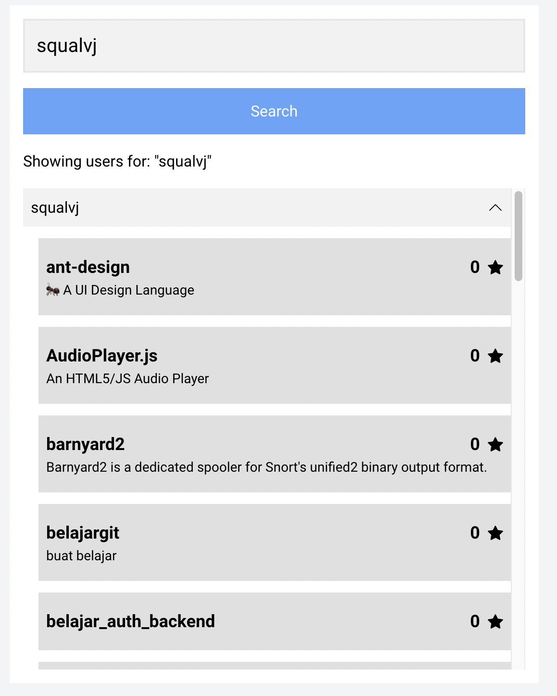

# Github User Finder
Simple app for searching github user and their repository built in purely react

# Installation
## Clone the repository
Run "npm install" to install the dependencies
Run npm start to start the project
## Usage
1. type username
2. click enter or press button "Search"

# Features
- directly hit github api v3
- loader & error handling
- unit test

# Technologies Used
- React.JS
- Tailwind.css
- Jest + React Testing Library

# Tests
- run "npm run test" 